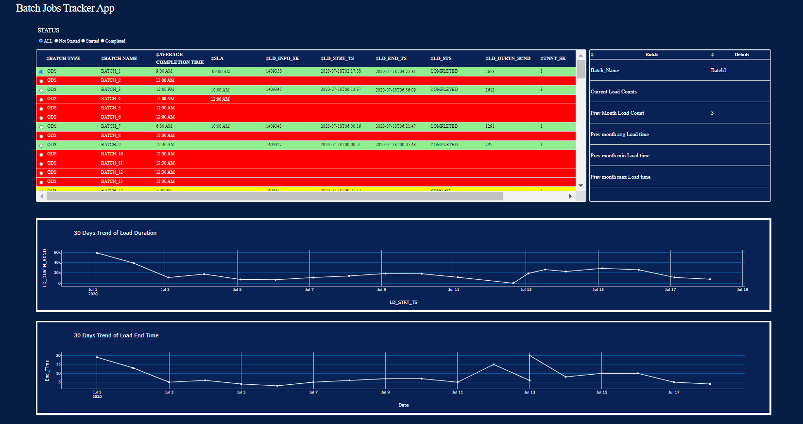

### Dash Application
Heroku Link: https://dash-application.herokuapp.com/

1. 3 files has been used for the tables and plots in the app.

 1. BATCH_SLA.csv
 2. ld_info.csv
 3. cc_ds_jobs_stats.csv
 
3. The rows are selectable which populates the 2nd table with the details of the selected batch ( The table to be displayed can be changed in utils.py).

    1. The current load count is taken from cc_ds_jobs_stats.csv file for the selected batch and date.
    2. Prev. Month Load count is taken as the sum of all the load counts of previous month for selected batch.
    3. Prev. Month Load time is not avialable in the ld_info file so its blank for all batches.
    4. if the data is blank, it means its not found in the datasets.
    5. In 2nd plot the End time is taken as hour at which job is completed.

### Database connection details. 

1. Install required drivers to connect Netezza using python. Details are here (https://dwgeek.com/connecting-netezza-using-python-pyodbc-working-example.html/)
2. Run the following code in app.py file (replacing the database details)

    import pyodbc

    conn = pyodbc.connect("DRIVER={NetezzaSQL};SERVER=192.168.010; PORT=5480;DATABASE=TESTDB; UID=admin;PWD=password;")

    cus=conn.cursor()

    ld_info=cus.execute("select * from ld.info;")

    bach_sla=cus.execute("select * from BATCH_SLA;")

    ld_counts=cus.execute("select * from ld_counts")
